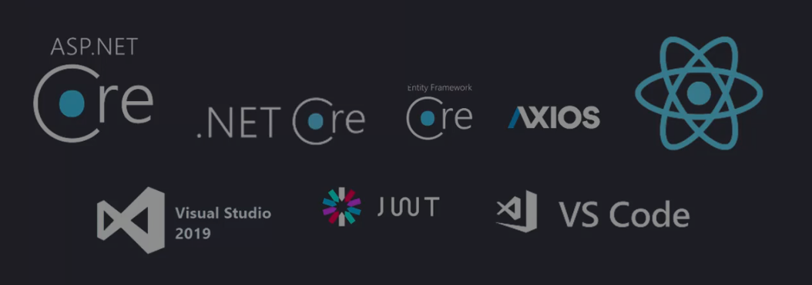
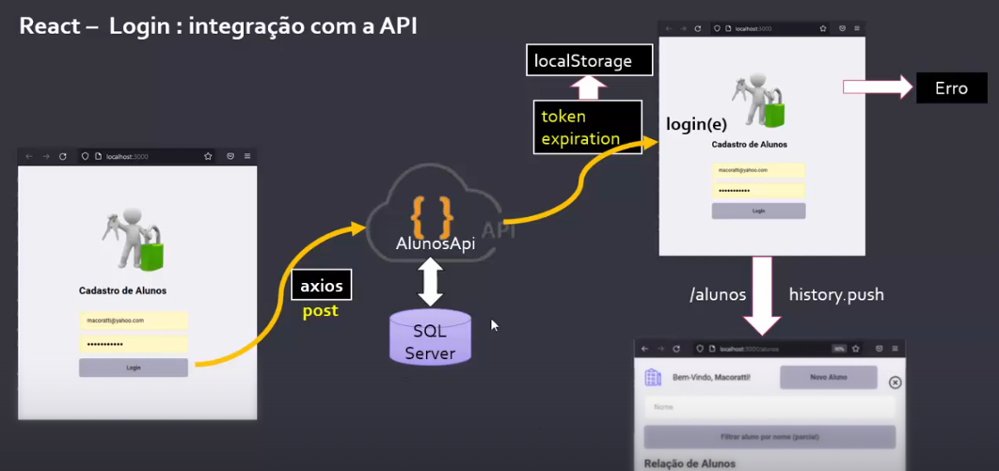

# 📚 Cadastro de Alunos (Frontend)

Este projeto é uma aplicação **Frontend** construída com **React.js** para gerenciar um sistema de cadastro de alunos.

O aplicativo inclui:
* **Autenticação:** Tela de Login com persistência de token (salvo no `localStorage`).
* **Proteção de Rotas:** Impede o acesso a rotas internas (Listagem e Cadastro) sem autenticação válida.
* **CRUD Básico:** Funcionalidades de listagem, busca e navegação para edição/cadastro de registros.

---

## 🚀 Tecnologias Utilizadas



| Tecnologia | Função |
| :--- | :--- |
| **React** | Biblioteca principal para construção da interface. |
| **React Router Dom (v6)** | Gerenciamento de rotas e criação de rotas privadas (`PrivateRoute`). |
| **Axios** | Cliente HTTP para comunicação com a API de backend. |
| **`react-icons`** | Inclusão de ícones (Editar, Excluir, Sair). |
| **`cross-env`** | Ferramenta para execução de scripts (`npm start`) compatível com Windows. |

---

### 🔑 Fluxo de Autenticação e Login



---

## 🛠️ Configuração Inicial e Execução

Para iniciar a aplicação em seu ambiente de desenvolvimento, siga os passos abaixo:

### Pré-requisitos

* **Node.js** e **npm** (ou Yarn) instalados.
* O **Backend da API (https://github.com/GabCarvaS/Cadastro-de-Alunos-Backend)** deve estar rodando e acessível na URL configurada.

### 1. Instalação de Dependências

No diretório raiz do projeto, execute:

```bash
npm install
# ou
# yarn install